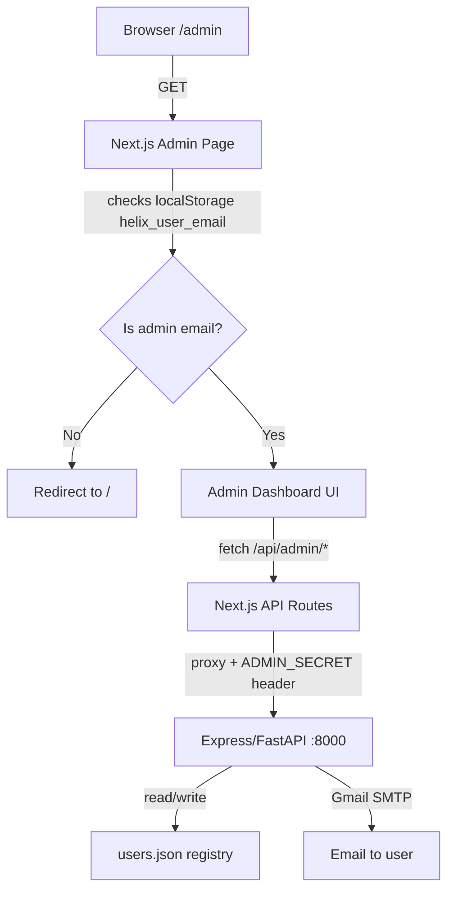
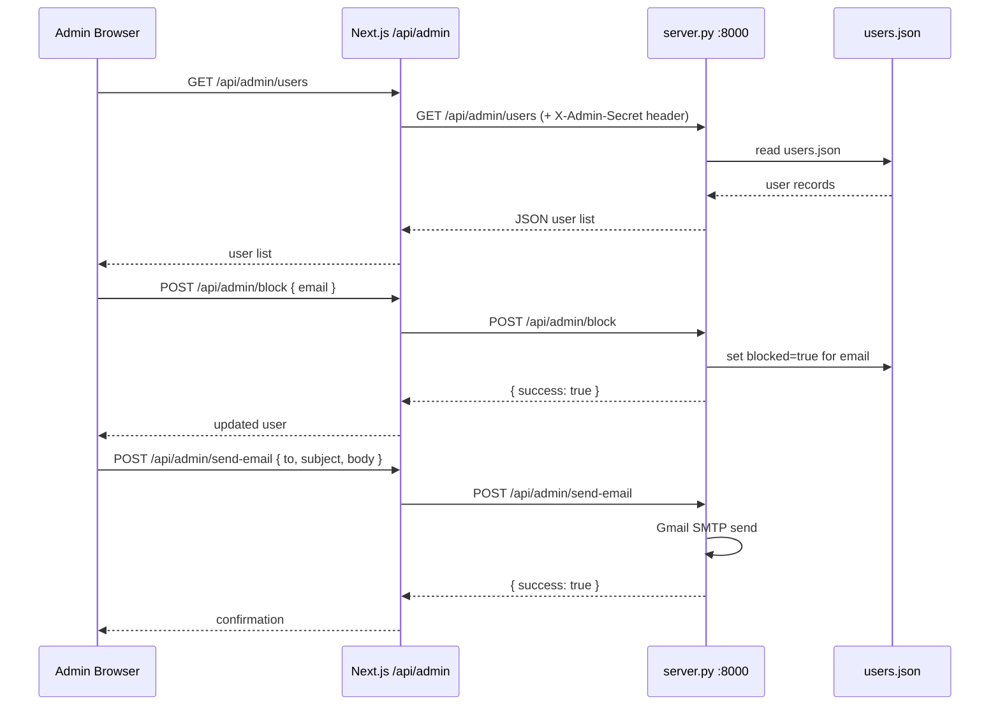

# Design Document: Admin Dashboard

## Overview

The Admin Dashboard is a secure, server-side-protected page at `/admin` in the Helix Next.js app that gives the admin full visibility and control over all registered users. It surfaces a live user registry (backed by a persistent JSON file on the server), lets the admin send emails to any user via the existing Gmail SMTP setup, block/unblock users from sending messages to Helix, and view per-user stats (plan, last active time, message count, sign-up date).

Access is gated by a hardcoded admin email check — only the configured `ADMIN_EMAIL` can reach the dashboard. All admin actions are proxied through new Express/FastAPI endpoints on the backend (port 8000), keeping secrets server-side.

---

## Architecture





---

## Components and Interfaces

### Component 1: `/admin` Page (`helix-app/app/admin/page.tsx`)

**Purpose**: The main admin dashboard UI — renders the user table, action buttons, and stat cards.

**Interface**:
```typescript
// Page component — no props (Next.js page)
export default function AdminPage(): JSX.Element

// Internal state shape
interface AdminState {
  users: UserRecord[]
  loading: boolean
  selectedUser: UserRecord | null
  emailModal: { open: boolean; to: string; subject: string; body: string }
  searchQuery: string
  filterStatus: 'all' | 'active' | 'blocked'
}
```

**Responsibilities**:
- Check `localStorage.helix_user_email` against `NEXT_PUBLIC_ADMIN_EMAIL` on mount; redirect non-admins to `/`
- Fetch and display the full user list from `/api/admin/users`
- Provide block/unblock toggle per user row
- Open email compose modal for any selected user
- Show aggregate stats (total users, blocked count, active today)

---

### Component 2: `UserTable` (`helix-app/app/admin/components/UserTable.tsx`)

**Purpose**: Renders the paginated, searchable list of all registered users.

**Interface**:
```typescript
interface UserRecord {
  email: string
  name: string
  plan: 'free' | 'pro' | 'proplus' | 'ultra'
  signedUpAt: string        // ISO timestamp
  lastActiveAt: string      // ISO timestamp
  messageCount: number
  blocked: boolean
  loginCount: number
}

interface UserTableProps {
  users: UserRecord[]
  onBlock: (email: string) => void
  onUnblock: (email: string) => void
  onSendEmail: (user: UserRecord) => void
  searchQuery: string
  filterStatus: 'all' | 'active' | 'blocked'
}
```

**Responsibilities**:
- Filter users by search query (email/name) and status filter
- Render each user row with: avatar initial, email, name, plan badge, last active, message count, blocked status, action buttons
- Highlight blocked users with a muted/red tint

---

### Component 3: `EmailModal` (`helix-app/app/admin/components/EmailModal.tsx`)

**Purpose**: Compose and send an email to a selected user.

**Interface**:
```typescript
interface EmailModalProps {
  open: boolean
  to: string
  onClose: () => void
  onSend: (subject: string, body: string) => Promise<void>
}
```

**Responsibilities**:
- Controlled form for subject + body
- Calls `onSend` which hits `/api/admin/send-email`
- Shows loading state and success/error feedback

---

### Component 4: `StatCards` (`helix-app/app/admin/components/StatCards.tsx`)

**Purpose**: Summary metrics bar at the top of the dashboard.

**Interface**:
```typescript
interface StatCardsProps {
  totalUsers: number
  blockedUsers: number
  activeToday: number
  totalMessages: number
}
```

---

## Data Models

### UserRecord (server-side, `users.json`)

```typescript
interface UserRecord {
  email: string           // primary key
  name: string
  plan: string            // 'free' | 'pro' | 'proplus' | 'ultra'
  signedUpAt: string      // ISO 8601
  lastActiveAt: string    // ISO 8601 — updated on each login/OTP verify
  messageCount: number    // incremented by chat endpoint
  loginCount: number
  blocked: boolean        // if true, /api/chat returns 403 for this email
  picture?: string        // Google profile picture URL
}
```

**Storage**: `users.json` at the server root (same directory as `server.py`). Loaded into memory on startup, written back on every mutation. This avoids a database dependency while keeping data persistent across restarts.

**Validation Rules**:
- `email` must be a non-empty string containing `@`
- `blocked` defaults to `false` on creation
- `messageCount` and `loginCount` default to `0`
- `signedUpAt` and `lastActiveAt` set to `new Date().toISOString()` on first registration

---

### Admin API Request/Response Models

```typescript
// GET /api/admin/users
// Response:
interface GetUsersResponse {
  users: UserRecord[]
}

// POST /api/admin/block
interface BlockRequest { email: string }
interface BlockResponse { success: boolean; user: UserRecord }

// POST /api/admin/unblock
interface UnblockRequest { email: string }
interface UnblockResponse { success: boolean; user: UserRecord }

// POST /api/admin/send-email
interface SendEmailRequest {
  to: string
  subject: string
  body: string      // plain text or HTML
}
interface SendEmailResponse { success: boolean }

// POST /api/admin/update-plan
interface UpdatePlanRequest { email: string; plan: string }
interface UpdatePlanResponse { success: boolean; user: UserRecord }
```

---

## Key Functions with Formal Specifications

### `registerOrUpdateUser(email, name, picture?)`

Called from `/api/auth/verify-otp` and the Google login flow whenever a user successfully authenticates.

**Preconditions**:
- `email` is a non-empty string containing `@`
- `name` is a non-empty string

**Postconditions**:
- If user with `email` does not exist in `users.json`: a new `UserRecord` is created with `blocked=false`, `messageCount=0`, `loginCount=1`, `signedUpAt=now`, `lastActiveAt=now`
- If user already exists: `lastActiveAt` is updated to `now`, `loginCount` is incremented by 1
- `users.json` is written to disk after the mutation
- Returns the final `UserRecord`

**Loop Invariants**: N/A (no loops)

---

### `checkBlocked(email)`

Called at the top of `/api/chat` before processing any message.

**Preconditions**:
- `email` is a non-empty string

**Postconditions**:
- Returns `true` if a `UserRecord` with matching `email` exists and `blocked === true`
- Returns `false` in all other cases (user not found, or `blocked === false`)
- No mutations to `users.json`

---

### `blockUser(email)` / `unblockUser(email)`

**Preconditions**:
- `email` exists in `users.json`
- Request carries valid `X-Admin-Secret` header

**Postconditions**:
- `blocked` field is set to `true` (block) or `false` (unblock) for the matching record
- `users.json` is written to disk
- Returns updated `UserRecord`
- If `email` not found: returns HTTP 404

---

### `sendAdminEmail(to, subject, body)`

**Preconditions**:
- `to` is a valid email address
- `subject` and `body` are non-empty strings
- `GMAIL_USER` and `GMAIL_APP_PASSWORD` env vars are set

**Postconditions**:
- Email is sent via Gmail SMTP using existing `send_email()` helper in `server.py`
- Returns `{ success: true }` on success
- Raises HTTP 500 with error detail on SMTP failure
- No mutations to `users.json`

---

## Algorithmic Pseudocode

### User Registration Flow

```pascal
PROCEDURE registerOrUpdateUser(email, name, picture)
  INPUT: email: String, name: String, picture: String | null
  OUTPUT: user: UserRecord

  SEQUENCE
    users ← loadUsersFromDisk()
    existing ← users.find(u => u.email = email)

    IF existing IS NULL THEN
      newUser ← {
        email: email,
        name: name,
        plan: "free",
        signedUpAt: now(),
        lastActiveAt: now(),
        messageCount: 0,
        loginCount: 1,
        blocked: false,
        picture: picture
      }
      users.append(newUser)
      saveUsersToDisk(users)
      RETURN newUser
    ELSE
      existing.lastActiveAt ← now()
      existing.loginCount ← existing.loginCount + 1
      IF picture IS NOT NULL THEN
        existing.picture ← picture
      END IF
      saveUsersToDisk(users)
      RETURN existing
    END IF
  END SEQUENCE
END PROCEDURE
```

### Block Check in Chat Endpoint

```pascal
PROCEDURE handleChatRequest(req)
  INPUT: req (HTTP request with body.email)
  OUTPUT: HTTP response

  SEQUENCE
    email ← req.body.email

    IF email IS NOT NULL THEN
      isBlocked ← checkBlocked(email)
      IF isBlocked THEN
        RETURN HTTP 403 { error: "Your account has been suspended." }
      END IF
    END IF

    // ... existing chat processing logic ...
    RETURN HTTP 200 { reply: ... }
  END SEQUENCE
END PROCEDURE
```

### Admin Auth Guard (Next.js middleware / page-level)

```pascal
PROCEDURE adminAuthGuard()
  INPUT: none (reads localStorage)
  OUTPUT: redirect or allow

  SEQUENCE
    email ← localStorage.getItem("helix_user_email")
    adminEmail ← process.env.NEXT_PUBLIC_ADMIN_EMAIL

    IF email IS NULL OR email ≠ adminEmail THEN
      router.push("/")
      RETURN
    END IF

    // Proceed to render dashboard
  END SEQUENCE
END PROCEDURE
```

---

## Example Usage

```typescript
// Admin page mount — auth guard
useEffect(() => {
  const email = localStorage.getItem('helix_user_email')
  if (email !== process.env.NEXT_PUBLIC_ADMIN_EMAIL) {
    router.push('/')
    return
  }
  fetchUsers()
}, [])

// Fetch all users
async function fetchUsers() {
  const res = await fetch('/api/admin/users')
  const data = await res.json()
  setUsers(data.users)
}

// Block a user
async function handleBlock(email: string) {
  await fetch('/api/admin/block', {
    method: 'POST',
    headers: { 'Content-Type': 'application/json' },
    body: JSON.stringify({ email }),
  })
  setUsers(prev => prev.map(u => u.email === email ? { ...u, blocked: true } : u))
}

// Send email to user
async function handleSendEmail(to: string, subject: string, body: string) {
  await fetch('/api/admin/send-email', {
    method: 'POST',
    headers: { 'Content-Type': 'application/json' },
    body: JSON.stringify({ to, subject, body }),
  })
}
```

---

## Error Handling

### Unauthorized Access Attempt

**Condition**: A non-admin user navigates to `/admin`
**Response**: Client-side redirect to `/` immediately on mount (before any data is fetched)
**Recovery**: No data is ever exposed; the redirect is synchronous

### Admin Secret Mismatch on Backend

**Condition**: A request reaches `/api/admin/*` without the correct `X-Admin-Secret` header
**Response**: HTTP 401 `{ error: "Unauthorized" }`
**Recovery**: Next.js API routes always inject the secret from `ADMIN_SECRET` env var; direct browser access to `:8000` is blocked by CORS

### User Not Found (block/unblock)

**Condition**: Admin tries to block an email that doesn't exist in `users.json`
**Response**: HTTP 404 `{ error: "User not found" }`
**Recovery**: UI shows a toast error; user list is refreshed

### Email Send Failure

**Condition**: Gmail SMTP fails (wrong credentials, rate limit, network error)
**Response**: HTTP 500 with SMTP error detail
**Recovery**: Modal stays open, error message shown inline; admin can retry

### `users.json` Read/Write Failure

**Condition**: Disk I/O error when reading or writing the user registry
**Response**: HTTP 500; server logs the error
**Recovery**: In-memory state is still valid for the current process; admin is notified via error response

---

## Testing Strategy

### Unit Testing Approach

- `registerOrUpdateUser`: test new user creation, existing user update (loginCount increment, lastActiveAt update), and edge cases (missing picture, duplicate email)
- `checkBlocked`: test blocked=true returns true, blocked=false returns false, unknown email returns false
- `blockUser` / `unblockUser`: test state transitions and 404 on unknown email
- `adminAuthGuard`: test redirect for non-admin email, allow for admin email

### Property-Based Testing Approach

**Property Test Library**: fast-check (already used in the project via Jest)

Key properties to verify:
- For any valid email, `registerOrUpdateUser` followed by `checkBlocked` returns `false` (new users are never blocked by default)
- For any user, `blockUser` then `unblockUser` returns the user to `blocked=false` (idempotent round-trip)
- `registerOrUpdateUser` called N times for the same email results in exactly one record in `users.json` with `loginCount === N`
- `sendAdminEmail` with any non-empty `to`, `subject`, `body` never mutates `users.json`

### Integration Testing Approach

- Full auth flow: OTP verify → user appears in `users.json` → visible in admin dashboard
- Block flow: admin blocks user → user's next `/api/chat` call returns 403
- Email flow: admin sends email → Gmail SMTP delivers (smoke test with real credentials in dev)

---

## Security Considerations

- **Admin email check is client-side** (localStorage) — this is a UX gate only. The real security is the `X-Admin-Secret` header checked on every backend admin endpoint. Even if someone bypasses the frontend redirect, they cannot call the backend without the secret.
- **`ADMIN_SECRET`** is a server-only env var (not prefixed with `NEXT_PUBLIC_`). It is injected by Next.js API routes and never sent to the browser.
- **`NEXT_PUBLIC_ADMIN_EMAIL`** is exposed to the client intentionally — it's only used to show/hide the UI, not to grant access.
- **CORS** on the Express/FastAPI server already restricts cross-origin requests; direct calls to `:8000/api/admin/*` from a browser will be blocked.
- **`users.json`** should not be served as a static file. The Express `app.use(express.static(__dirname))` line in `server.js` should be reviewed to ensure `users.json` is not publicly accessible — a `.gitignore` entry and an explicit static exclusion should be added.

---

## Performance Considerations

- `users.json` is loaded into memory on server startup and kept in a module-level variable. All reads are in-memory (O(n) scan). Writes flush the full file to disk. This is acceptable for hundreds to low thousands of users.
- If the user base grows significantly, the flat-file approach should be replaced with SQLite (via `better-sqlite3` in Node or the built-in `sqlite3` module in Python).
- The admin dashboard fetches the full user list on mount. For large lists, server-side pagination should be added to the `/api/admin/users` endpoint.

---

## Dependencies

- **Existing**: `nodemailer` / Python `smtplib` (already configured), `express`/`fastapi`, Next.js, React, TypeScript
- **New (optional)**: No new dependencies required. The flat-file `users.json` approach uses only Node.js `fs` / Python `json` builtins.
- **Environment variables to add**:
  - `ADMIN_EMAIL` — the hardcoded admin Gmail address (server-side)
  - `NEXT_PUBLIC_ADMIN_EMAIL` — same value, exposed to Next.js client for UI gating
  - `ADMIN_SECRET` — a random secret string shared between Next.js API routes and the backend, used to authenticate admin API calls

---

## Correctness Properties

*A property is a characteristic or behavior that should hold true across all valid executions of a system — essentially, a formal statement about what the system should do. Properties serve as the bridge between human-readable specifications and machine-verifiable correctness guarantees.*

### Property 1: New users are never blocked by default

*For any* valid email and name, calling `registerOrUpdateUser` for the first time and then calling `checkBlocked` for that email SHALL return `false`.

**Validates: Requirements 1.2, 4.1**

---

### Property 2: Registration deduplication invariant

*For any* email, calling `registerOrUpdateUser` N times SHALL result in exactly one UserRecord in the Registry with `loginCount === N`.

**Validates: Requirements 1.3, 1.4**

---

### Property 3: Block/unblock round-trip

*For any* existing user, calling `blockUser` followed by `unblockUser` SHALL result in the user's `blocked` field being `false` — restoring the original unblocked state.

**Validates: Requirements 4.1, 4.2**

---

### Property 4: Blocked users are rejected at the Chat Endpoint

*For any* user whose `blocked` field is `true`, a request to the Chat_Endpoint SHALL return HTTP 403 without producing a chat reply.

**Validates: Requirements 4.5**

---

### Property 5: Unblocked users are not rejected at the Chat Endpoint

*For any* user whose `blocked` field is `false`, a request to the Chat_Endpoint SHALL NOT return HTTP 403.

**Validates: Requirements 4.6**

---

### Property 6: Admin secret gate on all admin endpoints

*For any* request to any `/api/admin/*` endpoint that does not carry the correct `X-Admin-Secret` header value, THE Server SHALL return HTTP 401.

**Validates: Requirements 2.3**

---

### Property 7: User list completeness

*For any* set of UserRecords stored in the Registry, a `GET /api/admin/users` request with a valid admin secret SHALL return all of those records in the response.

**Validates: Requirements 3.1**

---

### Property 8: Search filter correctness

*For any* search query string and any set of UserRecords, the filtered result set SHALL contain only UserRecords whose email or name contains the query (case-insensitive), and SHALL contain all such matching records.

**Validates: Requirements 3.3**

---

### Property 9: Status filter correctness

*For any* status filter value (`blocked` or `active`) and any set of UserRecords, the filtered result set SHALL contain only UserRecords matching that status, and SHALL contain all such matching records.

**Validates: Requirements 3.4, 3.5**

---

### Property 10: Email send does not mutate the Registry

*For any* call to `sendAdminEmail` with any `to`, `subject`, and `body` values, the contents of the Registry SHALL be identical before and after the call.

**Validates: Requirements 5.6**

---

### Property 11: Stats are derived correctly from the user list

*For any* set of UserRecords, the StatCards metrics (total users, blocked count, active today, total messages) SHALL equal the values computed by counting and summing the corresponding fields across all UserRecords.

**Validates: Requirements 6.1, 6.2**

---

### Property 12: Plan update is reflected in the Registry

*For any* existing user and any valid plan value (`free`, `pro`, `proplus`, `ultra`), calling `updatePlan` SHALL result in the user's `plan` field in the Registry equaling the new plan value.

**Validates: Requirements 7.2**
