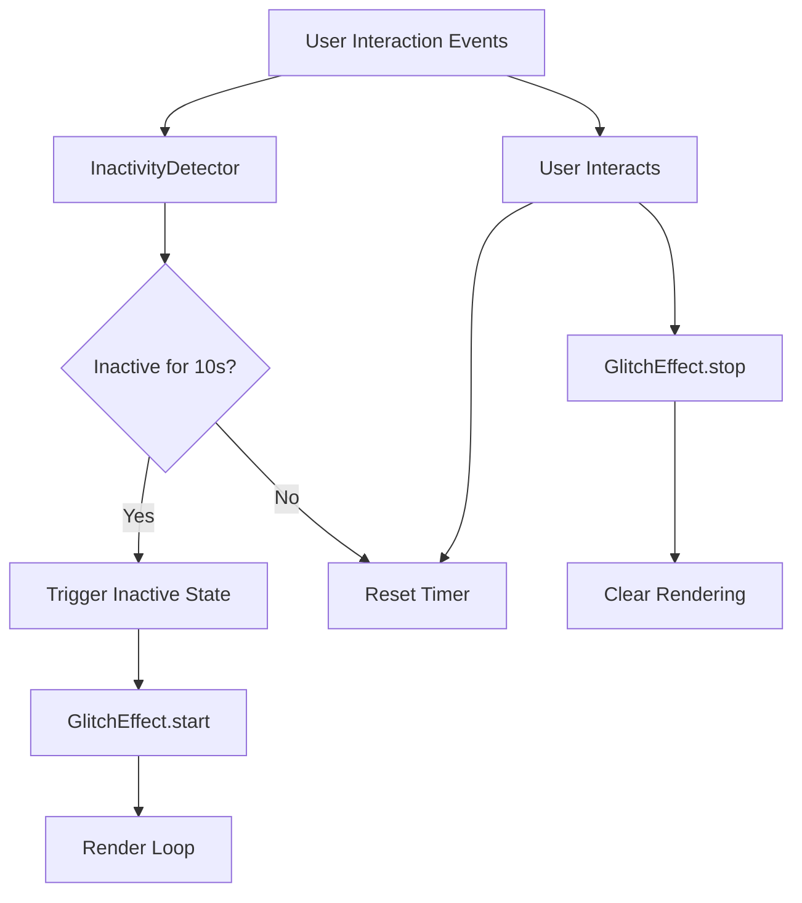

# Design Document: Inactivity Glitch Effect

## Overview

This design document specifies the technical implementation for an inactivity detection and visual feedback system for the chat interface (chat.html). The system consists of two primary components:

1. **InactivityDetector**: Monitors user interaction events and triggers state changes based on inactivity duration
2. **GlitchEffect**: Renders animated visual effects in the background when inactivity is detected

The system is designed to be lightweight, performant, and non-intrusive, providing ambient visual feedback without interfering with the core chat functionality. The implementation uses vanilla JavaScript with modern browser APIs to ensure broad compatibility while maintaining optimal performance.

### Design Goals

- **Minimal Performance Impact**: Use efficient event handling and rendering techniques
- **Non-Intrusive**: Visual effects should not interfere with user interactions or chat functionality
- **Responsive**: Immediate activation/deactivation based on user activity
- **Cross-Platform**: Support desktop (mouse/keyboard) and mobile (touch) interactions
- **Resource Efficient**: Clean up resources when not in use

## Architecture

The system follows a modular architecture with clear separation of concerns:



### Component Interaction Flow

1. **Initialization**: Both components initialize when the page loads
2. **Monitoring Phase**: InactivityDetector listens for user interaction events
3. **Inactivity Detected**: After 10 seconds of no interaction, InactivityDetector triggers the inactive state
4. **Effect Activation**: GlitchEffect begins rendering visual animations
5. **User Returns**: Any user interaction stops the effect and resets the timer
6. **Cleanup**: Resources are released when the page unloads

## Components and Interfaces

### InactivityDetector Component

**Responsibility**: Monitor user interactions and manage inactivity state

**Public Interface**:
```javascript
class InactivityDetector {
  constructor(options)
  start()
  stop()
  reset()
  on(event, callback)
  off(event, callback)
}
```

**Configuration Options**:
```javascript
{
  threshold: 10000,           // Inactivity threshold in milliseconds (default: 10000)
  throttleDelay: 100,         // Event throttle delay in milliseconds (default: 100)
  events: [                   // Events to monitor
    'mousemove',
    'mousedown',
    'keydown',
    'touchstart',
    'touchmove',
    'scroll',
    'wheel'
  ]
}
```

**Events Emitted**:
- `inactive`: Fired when inactivity threshold is reached
- `active`: Fired when user interaction resumes after being inactive

**Internal State**:
- `isActive`: Boolean indicating current activity state
- `timerId`: Reference to the setTimeout timer
- `lastActivityTime`: Timestamp of last detected activity
- `eventListeners`: Map of bound event listener functions

### GlitchEffect Component

**Responsibility**: Render visual glitch effects in the background

**Public Interface**:
```javascript
class GlitchEffect {
  constructor(options)
  start()
  stop()
  isRunning()
}
```

**Configuration Options**:
```javascript
{
  container: document.body,   // Container element for the effect
  zIndex: -1,                 // Z-index for layering (default: -1)
  intensity: 'medium',        // Effect intensity: 'low', 'medium', 'high'
  frameRate: 30,              // Target frame rate (default: 30)
  colors: {                   // Color scheme for glitch effect
    primary: '#ff00ff',
    secondary: '#00ffff',
    tertiary: '#ffff00'
  }
}
```

**Rendering Methods**:
The component supports multiple rendering approaches:
1. **CSS Animation** (Primary): Uses CSS keyframe animations for best performance
2. **Canvas** (Fallback): Uses HTML5 Canvas API for more complex effects
3. **WebGL** (Optional): For advanced shader-based effects (future enhancement)

### Integration Layer

**Responsibility**: Connect InactivityDetector and GlitchEffect components

```javascript
class InactivityGlitchSystem {
  constructor(detectorOptions, effectOptions)
  initialize()
  destroy()
}
```

This integration layer handles:
- Component lifecycle management
- Event binding between detector and effect
- Graceful degradation for unsupported browsers
- Resource cleanup on page unload

## Data Models

### InactivityState

```javascript
{
  isInactive: boolean,        // Current inactivity status
  lastActivityTime: number,   // Timestamp of last activity (ms since epoch)
  inactiveDuration: number,   // Duration of current inactive period (ms)
  activityCount: number       // Number of activity events since page load
}
```

### GlitchEffectState

```javascript
{
  isRunning: boolean,         // Whether effect is currently rendering
  startTime: number,          // When effect started (ms since epoch)
  frameCount: number,         // Number of frames rendered
  currentIntensity: number,   // Current effect intensity (0-1)
  renderMethod: string        // 'css' | 'canvas' | 'webgl'
}
```

### Configuration

```javascript
{
  inactivity: {
    threshold: number,        // Milliseconds before triggering inactive state
    throttleDelay: number,    // Milliseconds between event processing
    monitoredEvents: string[] // Array of event names to monitor
  },
  glitch: {
    zIndex: number,           // CSS z-index for effect layer
    intensity: string,        // 'low' | 'medium' | 'high'
    frameRate: number,        // Target frames per second
    colors: object,           // Color configuration
    transitionDuration: number // Fade in/out duration (ms)
  },
  performance: {
    useThrottling: boolean,   // Enable event throttling
    useDebouncing: boolean,   // Enable event debouncing
    maxFrameRate: number,     // Cap frame rate for performance
    enableMetrics: boolean    // Track performance metrics
  }
}
```

## Correctness Properties

*A property is a characteristic or behavior that should hold true across all valid executions of a system—essentially, a formal statement about what the system should do. Properties serve as the bridge between human-readable specifications and machine-verifiable correctness guarantees.*

### Property 1: Inactivity Detection Accuracy

*For any* sequence of user interaction events, when no events occur for exactly 10 seconds (±100ms tolerance), the InactivityDetector SHALL trigger the inactive state exactly once.

**Validates: Requirements 1.3, 1.4**

### Property 2: Timer Reset Idempotence

*For any* user interaction event that occurs while the inactivity timer is running, the timer SHALL be reset to zero, regardless of how many times the event fires within the throttle window.

**Validates: Requirements 1.2, 5.1**

### Property 3: Effect Activation Responsiveness

*For any* inactive state trigger, the GlitchEffect SHALL begin rendering within 100 milliseconds of the trigger event.

**Validates: Requirements 2.1**

### Property 4: Effect Deactivation Responsiveness

*For any* user interaction event that occurs while the GlitchEffect is active, the effect SHALL stop rendering within 100 milliseconds of the interaction.

**Validates: Requirements 3.1**

### Property 5: Event Listener Cleanup

*For any* page unload or navigation event, all event listeners registered by the InactivityDetector SHALL be removed, preventing memory leaks.

**Validates: Requirements 5.3**

### Property 6: Non-Interference with UI

*For any* pointer event (mouse click, touch) on interactive elements, the GlitchEffect layer SHALL NOT intercept or prevent the event from reaching its target element.

**Validates: Requirements 4.4**

### Property 7: Resource Conservation

*For any* period when the GlitchEffect is not active (stopped state), the effect SHALL NOT consume rendering resources (no requestAnimationFrame callbacks, no CSS animations running).

**Validates: Requirements 5.2**

### Property 8: Cross-Device Event Detection

*For any* device type (desktop with mouse/keyboard or mobile with touch), the InactivityDetector SHALL correctly detect and respond to the appropriate interaction events for that device.

**Validates: Requirements 6.1, 6.2**

### Property 9: Graceful Degradation

*For any* browser that does not support the required rendering features (CSS animations or Canvas), the chat interface SHALL function normally without the GlitchEffect, and no errors SHALL be thrown.

**Validates: Requirements 6.4**

### Property 10: State Consistency

*For any* sequence of inactive/active state transitions, the system SHALL maintain consistent state where: (1) the effect is running if and only if the detector is in inactive state, and (2) the detector is in active state if and only if the effect is stopped.

**Validates: Requirements 2.3, 3.3**

## Error Handling

### Event Listener Errors

**Scenario**: Event listener throws an exception during execution

**Handling**:
- Wrap all event handlers in try-catch blocks
- Log errors to console for debugging
- Continue monitoring other events
- Do not crash the entire system

```javascript
try {
  this.handleUserActivity(event);
} catch (error) {
  console.error('[InactivityDetector] Event handler error:', error);
  // Continue operation
}
```

### Rendering Errors

**Scenario**: Canvas or WebGL context creation fails

**Handling**:
- Fall back to CSS animation method
- If CSS animations not supported, disable effect gracefully
- Log warning to console
- Ensure chat interface remains functional

```javascript
try {
  this.canvas = document.createElement('canvas');
  this.ctx = this.canvas.getContext('2d');
  if (!this.ctx) throw new Error('Canvas context not available');
} catch (error) {
  console.warn('[GlitchEffect] Canvas unavailable, using CSS fallback');
  this.renderMethod = 'css';
}
```

### Timer Errors

**Scenario**: setTimeout/clearTimeout fails or behaves unexpectedly

**Handling**:
- Validate timer ID before clearing
- Use defensive checks for timer state
- Reset timer state on errors
- Log errors for debugging

```javascript
if (this.timerId !== null) {
  try {
    clearTimeout(this.timerId);
  } catch (error) {
    console.error('[InactivityDetector] Timer clear error:', error);
  } finally {
    this.timerId = null;
  }
}
```

### Browser Compatibility Errors

**Scenario**: Required APIs not available in browser

**Handling**:
- Feature detection before initialization
- Graceful degradation to simpler implementations
- Clear user feedback if features unavailable
- No breaking errors

```javascript
if (!window.requestAnimationFrame) {
  console.warn('[GlitchEffect] requestAnimationFrame not supported');
  // Fallback to setTimeout-based animation
  window.requestAnimationFrame = (callback) => {
    return setTimeout(callback, 1000 / 60);
  };
}
```

### Memory Leak Prevention

**Scenario**: Event listeners or animation frames not cleaned up

**Handling**:
- Implement explicit cleanup methods
- Use WeakMap for event listener tracking
- Cancel animation frames on stop
- Remove DOM elements on destroy

```javascript
destroy() {
  this.stop();
  this.eventListeners.forEach((listener, event) => {
    document.removeEventListener(event, listener);
  });
  this.eventListeners.clear();
  if (this.effectElement) {
    this.effectElement.remove();
    this.effectElement = null;
  }
}
```

## Testing Strategy

### Unit Testing Approach

The testing strategy combines example-based unit tests with property-based tests to ensure comprehensive coverage.

**Unit Tests** will focus on:
- Specific initialization scenarios
- Event handler registration and cleanup
- State transitions (active ↔ inactive)
- Configuration validation
- Error handling paths
- Browser compatibility checks

**Property-Based Tests** will verify:
- Universal properties across all valid inputs
- Timing accuracy across random event sequences
- State consistency across random interaction patterns
- Resource cleanup across various lifecycle scenarios

### Test Categories

#### 1. InactivityDetector Tests

**Example-Based Unit Tests**:
- Test initialization with default options
- Test initialization with custom options
- Test event listener registration
- Test event listener removal on stop()
- Test timer starts on initialization
- Test timer resets on user activity
- Test inactive event fires after threshold
- Test active event fires on user interaction
- Test throttling prevents excessive timer resets
- Test cleanup on destroy()

**Property-Based Tests** (minimum 100 iterations each):

**Test 1: Timer Reset Property**
```javascript
// Feature: inactivity-glitch-effect, Property 2: Timer Reset Idempotence
// For any user interaction event that occurs while the inactivity timer is running,
// the timer SHALL be reset to zero, regardless of how many times the event fires
// within the throttle window.

fc.assert(
  fc.property(
    fc.array(fc.record({
      type: fc.constantFrom('mousemove', 'keydown', 'touchstart'),
      timestamp: fc.integer(0, 9999)
    })),
    (events) => {
      const detector = new InactivityDetector({ threshold: 10000, throttleDelay: 100 });
      detector.start();
      
      events.forEach(event => {
        detector.handleUserActivity({ type: event.type });
      });
      
      // After any activity, timer should be reset (not at threshold)
      return detector.getRemainingTime() === 10000;
    }
  ),
  { numRuns: 100 }
);
```

**Test 2: Inactivity Detection Accuracy**
```javascript
// Feature: inactivity-glitch-effect, Property 1: Inactivity Detection Accuracy
// For any sequence of user interaction events, when no events occur for exactly
// 10 seconds, the InactivityDetector SHALL trigger the inactive state exactly once.

fc.assert(
  fc.property(
    fc.integer(10000, 15000), // Wait time in ms
    async (waitTime) => {
      const detector = new InactivityDetector({ threshold: 10000 });
      let inactiveCount = 0;
      
      detector.on('inactive', () => inactiveCount++);
      detector.start();
      
      await sleep(waitTime);
      
      // Should trigger exactly once after threshold
      return inactiveCount === 1;
    }
  ),
  { numRuns: 100 }
);
```

**Test 3: Event Listener Cleanup**
```javascript
// Feature: inactivity-glitch-effect, Property 5: Event Listener Cleanup
// For any page unload or navigation event, all event listeners registered by
// the InactivityDetector SHALL be removed, preventing memory leaks.

fc.assert(
  fc.property(
    fc.array(fc.constantFrom('mousemove', 'keydown', 'touchstart', 'scroll')),
    (eventTypes) => {
      const detector = new InactivityDetector({ events: eventTypes });
      detector.start();
      
      const initialListenerCount = getEventListenerCount(document);
      detector.destroy();
      const finalListenerCount = getEventListenerCount(document);
      
      // All listeners should be removed
      return finalListenerCount <= initialListenerCount;
    }
  ),
  { numRuns: 100 }
);
```

#### 2. GlitchEffect Tests

**Example-Based Unit Tests**:
- Test initialization with default options
- Test initialization with custom options
- Test effect starts rendering
- Test effect stops rendering
- Test CSS animation method
- Test Canvas rendering method
- Test z-index positioning
- Test pointer-events: none
- Test frame rate limiting
- Test cleanup on destroy()

**Property-Based Tests** (minimum 100 iterations each):

**Test 4: Effect Activation Responsiveness**
```javascript
// Feature: inactivity-glitch-effect, Property 3: Effect Activation Responsiveness
// For any inactive state trigger, the GlitchEffect SHALL begin rendering within
// 100 milliseconds of the trigger event.

fc.assert(
  fc.property(
    fc.record({
      intensity: fc.constantFrom('low', 'medium', 'high'),
      frameRate: fc.integer(24, 60)
    }),
    async (config) => {
      const effect = new GlitchEffect(config);
      const startTime = performance.now();
      
      effect.start();
      await waitForRender();
      
      const elapsed = performance.now() - startTime;
      const isRunning = effect.isRunning();
      
      // Should start within 100ms
      return isRunning && elapsed < 100;
    }
  ),
  { numRuns: 100 }
);
```

**Test 5: Effect Deactivation Responsiveness**
```javascript
// Feature: inactivity-glitch-effect, Property 4: Effect Deactivation Responsiveness
// For any user interaction event that occurs while the GlitchEffect is active,
// the effect SHALL stop rendering within 100 milliseconds of the interaction.

fc.assert(
  fc.property(
    fc.integer(100, 5000), // Effect run time before stopping
    async (runTime) => {
      const effect = new GlitchEffect();
      effect.start();
      
      await sleep(runTime);
      const stopTime = performance.now();
      effect.stop();
      await waitForRender();
      
      const elapsed = performance.now() - stopTime;
      const isRunning = effect.isRunning();
      
      // Should stop within 100ms
      return !isRunning && elapsed < 100;
    }
  ),
  { numRuns: 100 }
);
```

**Test 6: Non-Interference with UI**
```javascript
// Feature: inactivity-glitch-effect, Property 6: Non-Interference with UI
// For any pointer event on interactive elements, the GlitchEffect layer SHALL NOT
// intercept or prevent the event from reaching its target element.

fc.assert(
  fc.property(
    fc.record({
      x: fc.integer(0, 1000),
      y: fc.integer(0, 1000),
      eventType: fc.constantFrom('click', 'mousedown', 'touchstart')
    }),
    (eventData) => {
      const effect = new GlitchEffect();
      effect.start();
      
      const button = document.createElement('button');
      document.body.appendChild(button);
      
      let eventReceived = false;
      button.addEventListener(eventData.eventType, () => {
        eventReceived = true;
      });
      
      // Simulate event at button position
      const event = new MouseEvent(eventData.eventType, {
        clientX: eventData.x,
        clientY: eventData.y,
        bubbles: true
      });
      button.dispatchEvent(event);
      
      document.body.removeChild(button);
      effect.stop();
      
      // Event should reach the button
      return eventReceived;
    }
  ),
  { numRuns: 100 }
);
```

**Test 7: Resource Conservation**
```javascript
// Feature: inactivity-glitch-effect, Property 7: Resource Conservation
// For any period when the GlitchEffect is not active, the effect SHALL NOT consume
// rendering resources.

fc.assert(
  fc.property(
    fc.integer(1, 10), // Number of start/stop cycles
    async (cycles) => {
      const effect = new GlitchEffect();
      
      for (let i = 0; i < cycles; i++) {
        effect.start();
        await sleep(100);
        effect.stop();
        
        // Check no animation frames are scheduled
        const hasActiveAnimations = effect.hasActiveAnimationFrame();
        if (hasActiveAnimations) return false;
      }
      
      return true;
    }
  ),
  { numRuns: 100 }
);
```

#### 3. Integration Tests

**Example-Based Integration Tests**:
- Test detector triggers effect on inactivity
- Test user interaction stops effect
- Test multiple inactive/active cycles
- Test effect respects z-index layering
- Test effect doesn't block chat interactions
- Test cleanup on page unload
- Test mobile touch events
- Test desktop mouse/keyboard events
- Test graceful degradation without Canvas support
- Test graceful degradation without CSS animation support

**Property-Based Integration Tests** (minimum 100 iterations each):

**Test 8: State Consistency**
```javascript
// Feature: inactivity-glitch-effect, Property 10: State Consistency
// For any sequence of inactive/active state transitions, the system SHALL maintain
// consistent state where the effect is running if and only if the detector is in
// inactive state.

fc.assert(
  fc.property(
    fc.array(fc.record({
      action: fc.constantFrom('wait', 'interact'),
      duration: fc.integer(100, 5000)
    })),
    async (actions) => {
      const system = new InactivityGlitchSystem();
      system.initialize();
      
      for (const action of actions) {
        if (action.action === 'wait') {
          await sleep(action.duration);
        } else {
          system.detector.handleUserActivity({ type: 'mousemove' });
        }
        
        // Check state consistency
        const detectorInactive = system.detector.isInactive();
        const effectRunning = system.effect.isRunning();
        
        if (detectorInactive !== effectRunning) {
          return false; // State mismatch
        }
      }
      
      system.destroy();
      return true;
    }
  ),
  { numRuns: 100 }
);
```

**Test 9: Cross-Device Event Detection**
```javascript
// Feature: inactivity-glitch-effect, Property 8: Cross-Device Event Detection
// For any device type, the InactivityDetector SHALL correctly detect and respond
// to the appropriate interaction events for that device.

fc.assert(
  fc.property(
    fc.record({
      deviceType: fc.constantFrom('desktop', 'mobile'),
      events: fc.array(fc.record({
        type: fc.constantFrom('mousemove', 'touchstart', 'keydown'),
        timestamp: fc.integer(0, 5000)
      }))
    }),
    async (testData) => {
      const system = new InactivityGlitchSystem();
      system.initialize();
      
      // Simulate device-specific events
      for (const event of testData.events) {
        if (testData.deviceType === 'mobile' && event.type === 'mousemove') {
          continue; // Skip mouse events on mobile
        }
        if (testData.deviceType === 'desktop' && event.type === 'touchstart') {
          continue; // Skip touch events on desktop
        }
        
        system.detector.handleUserActivity({ type: event.type });
        await sleep(event.timestamp);
      }
      
      // Detector should have responded to appropriate events
      const wasActive = system.detector.getActivityCount() > 0;
      system.destroy();
      
      return wasActive;
    }
  ),
  { numRuns: 100 }
);
```

### Test Environment Setup

**Testing Framework**: Jest (for JavaScript unit and integration tests)

**Property-Based Testing Library**: fast-check (JavaScript property-based testing)

**Test Configuration**:
```javascript
{
  testEnvironment: 'jsdom', // Simulate browser environment
  setupFilesAfterEnv: ['<rootDir>/test/setup.js'],
  coverageThreshold: {
    global: {
      branches: 80,
      functions: 85,
      lines: 85,
      statements: 85
    }
  }
}
```

**Mock Requirements**:
- Mock `requestAnimationFrame` for deterministic timing
- Mock `performance.now()` for time-based tests
- Mock DOM elements for rendering tests
- Mock event listeners for event handling tests

### Performance Testing

**Metrics to Track**:
- Event handler execution time (should be < 1ms)
- Effect render frame time (should maintain target FPS)
- Memory usage over time (should not grow unbounded)
- Event listener count (should not leak)

**Performance Benchmarks**:
- 1000 rapid user interactions should not cause lag
- Effect should render at target FPS (30-60) consistently
- Memory usage should stabilize after 5 minutes of operation
- No memory leaks after 100 start/stop cycles

### Browser Compatibility Testing

**Target Browsers**:
- Chrome 90+
- Firefox 88+
- Safari 14+
- Edge 90+
- Mobile Safari (iOS 14+)
- Chrome Mobile (Android 10+)

**Compatibility Test Matrix**:
- Test CSS animation support
- Test Canvas API support
- Test requestAnimationFrame support
- Test touch event support
- Test pointer event support
- Test event throttling behavior

### Continuous Integration

**CI Pipeline**:
1. Run unit tests on every commit
2. Run property-based tests (100 iterations) on every PR
3. Run integration tests on every PR
4. Run performance tests on main branch
5. Run browser compatibility tests weekly

**Test Execution Time Targets**:
- Unit tests: < 30 seconds
- Property-based tests: < 2 minutes
- Integration tests: < 1 minute
- Full test suite: < 5 minutes
