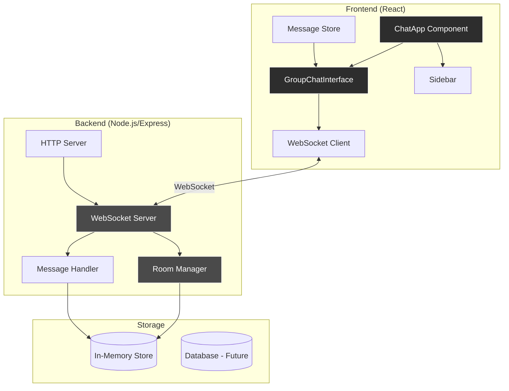
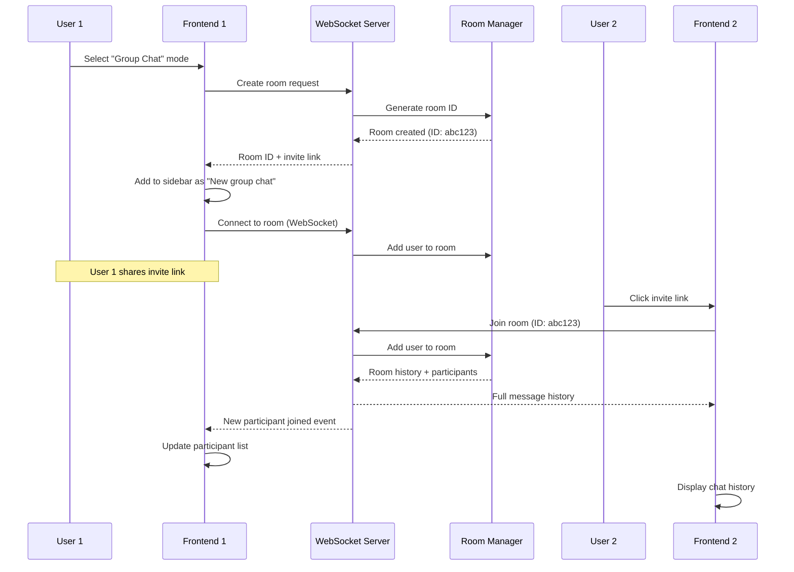
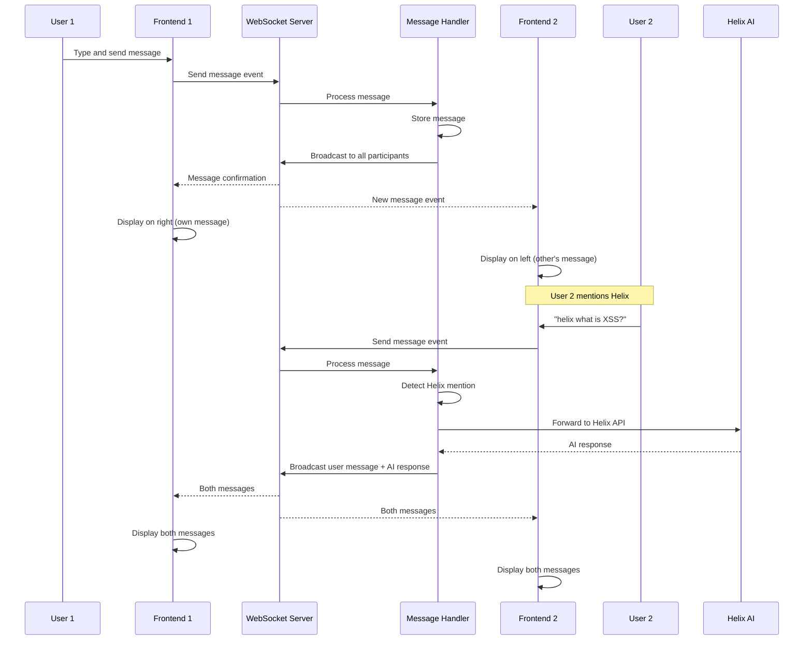

# Design Document: Real-time Group Chat

## Overview

The Real-time Group Chat feature enables multiple users to collaborate and chat together with Helix AI in a shared room. Inspired by ChatGPT's group chat functionality, this feature introduces a new "Group Chat" mode where users can create rooms, invite participants via shareable links, and engage in real-time conversations. Helix AI acts as a silent observer, responding only when explicitly mentioned by name (e.g., "helix what is...", "@helix reply to..."). The system leverages WebSocket technology for real-time message synchronization across all participants, with messages persisted for new joiners to see full conversation history.

The feature integrates seamlessly into the existing Helix AI interface, adding a new mode to the chat mode dropdown and displaying group chats in the sidebar alongside regular chats. Each group chat has a unique shareable link for invitation-based access without requiring authentication, making collaboration frictionless while maintaining the existing user experience patterns.

## Architecture

The system follows a client-server architecture with WebSocket-based real-time communication:



### Key Architectural Decisions

1. **WebSocket for Real-time Communication**: Chosen over HTTP polling for low-latency, bidirectional communication
2. **Link-based Access**: No authentication required for joining - simplifies onboarding and collaboration
3. **In-Memory Storage (MVP)**: Fast access for active sessions, with database migration path for production
4. **Helix Mention Detection**: Client-side parsing of messages to determine when Helix should respond
5. **Sidebar Integration**: Group chats appear in the same sidebar as regular chats for unified navigation

## Sequence Diagrams

### Creating and Joining a Group Chat



### Real-time Messaging Flow



## Components and Interfaces

### Component 1: GroupChatInterface

**Purpose**: Main UI component for group chat functionality, handling message display, input, and participant visualization

**Interface**:
```typescript
interface GroupChatInterfaceProps {
  roomId: string
  currentUserId: string
  userName: string
  userAvatar: string
  onLeaveRoom: () => void
}

interface GroupChatState {
  messages: GroupMessage[]
  participants: Participant[]
  isConnected: boolean
  inviteLink: string
}
```

**Responsibilities**:
- Establish and maintain WebSocket connection to room
- Display messages with sender identification (left/right alignment)
- Show participant avatars at top-right
- Handle message input and sending
- Generate and display invite link
- Detect Helix mentions in user input
- Manage connection state and reconnection logic

### Component 2: WebSocketClient

**Purpose**: Manages WebSocket connection lifecycle and event handling

**Interface**:
```typescript
interface WebSocketClient {
  connect(roomId: string, userId: string): Promise<void>
  disconnect(): void
  sendMessage(content: string): void
  onMessage(callback: (message: GroupMessage) => void): void
  onParticipantJoin(callback: (participant: Participant) => void): void
  onParticipantLeave(callback: (participantId: string) => void): void
  onConnectionChange(callback: (connected: boolean) => void): void
}
```

**Responsibilities**:
- Establish WebSocket connection with authentication
- Handle connection lifecycle (connect, disconnect, reconnect)
- Send and receive messages
- Emit events for UI updates
- Handle connection errors and retry logic

### Component 3: RoomManager (Backend)

**Purpose**: Server-side room state management and participant tracking

**Interface**:
```typescript
interface RoomManager {
  createRoom(): Room
  getRoom(roomId: string): Room | null
  addParticipant(roomId: string, participant: Participant): void
  removeParticipant(roomId: string, participantId: string): void
  getRoomParticipants(roomId: string): Participant[]
  getRoomMessages(roomId: string): GroupMessage[]
}

interface Room {
  id: string
  createdAt: number
  participants: Map<string, Participant>
  messages: GroupMessage[]
}
```

**Responsibilities**:
- Generate unique room IDs
- Track active rooms and participants
- Store message history per room
- Handle participant join/leave events
- Provide room state to new joiners

### Component 4: MessageHandler (Backend)

**Purpose**: Process incoming messages, detect Helix mentions, and coordinate AI responses

**Interface**:
```typescript
interface MessageHandler {
  processMessage(roomId: string, message: GroupMessage): Promise<void>
  detectHelixMention(content: string): boolean
  forwardToHelix(message: GroupMessage, roomHistory: GroupMessage[]): Promise<string>
  broadcastMessage(roomId: string, message: GroupMessage): void
}
```

**Responsibilities**:
- Validate and sanitize incoming messages
- Detect Helix mentions using pattern matching
- Forward mentioned messages to Helix AI API
- Broadcast messages to all room participants
- Handle AI response errors gracefully

## Data Models

### Model 1: GroupMessage

```typescript
interface GroupMessage {
  id: string              // Unique message ID
  roomId: string          // Room this message belongs to
  senderId: string        // User ID or "helix" for AI
  senderName: string      // Display name
  senderAvatar: string    // Avatar URL or initial
  content: string         // Message text
  timestamp: number       // Unix timestamp
  isHelixResponse: boolean // True if from Helix AI
}
```

**Validation Rules**:
- `id` must be unique across all messages
- `content` must be non-empty and max 4000 characters
- `timestamp` must be valid Unix timestamp
- `senderId` must match connected participant or "helix"

### Model 2: Participant

```typescript
interface Participant {
  id: string              // Unique participant ID (generated on join)
  name: string            // Display name
  avatar: string          // Avatar URL or initial
  joinedAt: number        // Unix timestamp
  isOnline: boolean       // Connection status
}
```

**Validation Rules**:
- `id` must be unique within room
- `name` must be non-empty and max 50 characters
- `joinedAt` must be valid Unix timestamp

### Model 3: Room

```typescript
interface Room {
  id: string                          // Unique room ID (shareable)
  createdAt: number                   // Unix timestamp
  participants: Map<string, Participant>
  messages: GroupMessage[]
  inviteLink: string                  // Full shareable URL
}
```

**Validation Rules**:
- `id` must be unique, URL-safe, and 12+ characters
- `participants` map must track all active connections
- `messages` array maintains chronological order

### Model 4: WebSocketEvent

```typescript
type WebSocketEvent = 
  | { type: 'join_room'; roomId: string; participant: Participant }
  | { type: 'leave_room'; roomId: string; participantId: string }
  | { type: 'send_message'; roomId: string; message: GroupMessage }
  | { type: 'message_broadcast'; message: GroupMessage }
  | { type: 'participant_joined'; participant: Participant }
  | { type: 'participant_left'; participantId: string }
  | { type: 'room_history'; messages: GroupMessage[]; participants: Participant[] }
  | { type: 'error'; code: string; message: string }
```

**Validation Rules**:
- All events must have valid `type` field
- Event payloads must match type-specific schema
- `roomId` must reference existing room for room-specific events

## Correctness Properties

*A property is a characteristic or behavior that should hold true across all valid executions of a system—essentially, a formal statement about what the system should do. Properties serve as the bridge between human-readable specifications and machine-verifiable correctness guarantees.*

### Property 1: Room ID Uniqueness

For any set of room creation requests, all generated room IDs must be unique and contain at least 128-bit entropy.

**Validates: Requirements 1.1, 1.3**

### Property 2: Invite Link Consistency

For any room, the generated invite link must contain the room ID and follow the expected URL format.

**Validates: Requirements 1.2, 1.4**

### Property 3: Message Delivery to All Online Participants

For any message broadcast in a room, all online participants in that room must receive the message.

**Validates: Requirements 2.1, 2.2**

### Property 4: Message Ordering Consistency

For any room and any sequence of messages, all participants must see messages in the same chronological order based on server-received timestamps.

**Validates: Requirements 2.3, 2.4**

### Property 5: Message Alignment Based on Sender

For any message, if sent by the current user, it must be aligned right; if sent by another participant, it must be aligned left.

**Validates: Requirements 3.1, 3.2**

### Property 6: Message Display Completeness

For any message, the rendered output must contain the sender's name, avatar, and timestamp.

**Validates: Requirements 3.3, 3.4**

### Property 7: Chronological Display Order

For any list of messages, the display order must match chronological order from oldest to newest.

**Validates: Requirements 3.5**

### Property 8: Helix Mention Detection Accuracy

For any message content, the system detects a Helix mention if and only if the content contains "helix" or "@helix" at the start or within the message.

**Validates: Requirements 4.1, 4.4**

### Property 9: AI Response Sender Identification

For any AI response message, the sender must be identified as "helix" and have distinct visual styling.

**Validates: Requirements 4.3, 4.5**

### Property 10: Room History Completeness

For any participant joining a room, they must receive the complete message history in chronological order.

**Validates: Requirements 5.1, 5.2**

### Property 11: History Display Before New Messages

For any join event, history messages must appear in the display before any new messages.

**Validates: Requirements 5.3**

### Property 12: Participant Join Event Broadcasting

For any participant join event, all other participants in the room must receive a participant_joined event.

**Validates: Requirements 6.1**

### Property 13: Participant Leave Event Broadcasting

For any participant leave event, all remaining participants in the room must receive a participant_left event.

**Validates: Requirements 6.2**

### Property 14: Participant Status Synchronization

For any participant connection status change, all participants in the room must see the updated status.

**Validates: Requirements 6.4**

### Property 15: Participant List Consistency

For any room state, all connected clients must have identical participant lists.

**Validates: Requirements 6.5**

### Property 16: Session Restoration on Reconnection

For any participant reconnecting within the timeout period, their session must be restored and missed messages synced.

**Validates: Requirements 7.3**

### Property 17: Empty Message Rejection

For any empty or whitespace-only string, the system must reject it as invalid message content.

**Validates: Requirements 8.1**

### Property 18: XSS Prevention Through Sanitization

For any message containing HTML or script tags, the content must be sanitized on the server before broadcasting.

**Validates: Requirements 8.3**

### Property 19: Client-Side HTML Escaping

For any message containing HTML or JavaScript, the content must be escaped during rendering on the client.

**Validates: Requirements 8.4**

### Property 20: Sidebar Update on Room Creation

For any group chat creation, the room must appear in the sidebar with the label "New group chat".

**Validates: Requirements 9.1**

### Property 21: Sidebar Update on Room Join

For any group chat join via invite link, the room must appear in the user's sidebar.

**Validates: Requirements 9.2**

### Property 22: Sidebar Navigation

For any group chat clicked in the sidebar, the correct room interface must open.

**Validates: Requirements 9.4**

### Property 23: Sidebar Persistence

For any sidebar state containing group chats, the state must persist across browser session restarts.

**Validates: Requirements 9.5**

### Property 24: Origin Header Validation

For any WebSocket connection attempt, the origin header must be validated to prevent CSRF attacks.

**Validates: Requirements 11.2**

### Property 25: Security Event Logging

For any room creation or join event, the event must be logged for security monitoring.

**Validates: Requirements 11.5**

## Error Handling

### Error Scenario 1: WebSocket Connection Failure

**Condition**: Client fails to establish WebSocket connection to server (network issue, server down)

**Response**: 
- Display connection error indicator in UI
- Show "Connecting..." status with retry countdown
- Attempt exponential backoff reconnection (1s, 2s, 4s, 8s, max 30s)
- Queue outgoing messages locally during disconnection

**Recovery**: 
- On successful reconnection, sync room state (fetch latest messages)
- Send queued messages in order
- Update UI to show "Connected" status

### Error Scenario 2: Invalid Room ID

**Condition**: User attempts to join room with non-existent or malformed room ID

**Response**:
- Return HTTP 404 or WebSocket error event
- Display user-friendly error: "This group chat doesn't exist or has expired"
- Offer option to create new group chat

**Recovery**:
- Redirect user to home screen or new chat creation flow

### Error Scenario 3: Helix AI API Failure

**Condition**: Helix mention detected but AI API returns error or times out

**Response**:
- Send error message to room: "Helix is temporarily unavailable. Try again in a moment."
- Log error details server-side for monitoring
- Do not block other messages or room functionality

**Recovery**:
- User can retry by mentioning Helix again
- System continues normal message flow

### Error Scenario 4: Message Send Failure

**Condition**: Client sends message but server fails to process or broadcast it

**Response**:
- Show "Failed to send" indicator on message bubble
- Provide retry button on failed message
- Keep message in local state for retry

**Recovery**:
- User clicks retry to resend message
- If retry fails after 3 attempts, show persistent error with option to copy message text

### Error Scenario 5: Participant Disconnect

**Condition**: Participant's WebSocket connection drops unexpectedly

**Response**:
- Server marks participant as offline after 30s timeout
- Broadcast participant_left event to remaining participants
- Keep participant in room state for potential reconnection

**Recovery**:
- If participant reconnects within 5 minutes, restore session
- Update participant status to online
- Sync missed messages to reconnected participant

## Testing Strategy

### Unit Testing Approach

**Frontend Components**:
- Test GroupChatInterface rendering with various message states
- Test WebSocketClient connection lifecycle and event emission
- Test Helix mention detection with various input patterns
- Test message alignment logic (own vs others)
- Test participant list rendering and updates

**Backend Services**:
- Test RoomManager room creation and participant management
- Test MessageHandler mention detection and AI forwarding
- Test WebSocket event routing and broadcasting
- Test room state persistence and retrieval

**Coverage Goals**: 80%+ line coverage, 100% coverage for critical paths (message delivery, mention detection)

### Property-Based Testing Approach

**Property Test Library**: fast-check (JavaScript/TypeScript)

**Key Properties to Test**:

1. **Message Ordering Property**:
   - Generate random sequences of messages from multiple participants
   - Verify all participants receive messages in same order
   - Property: `∀ message sequences, all participants see same order`

2. **Helix Mention Detection Property**:
   - Generate random strings with/without mention patterns
   - Verify detection accuracy (no false positives/negatives)
   - Property: `∀ strings, detectMention(s) ⟺ s contains valid mention pattern`

3. **Room State Consistency Property**:
   - Generate random join/leave/message events
   - Verify room state matches expected state after all events
   - Property: `∀ event sequences, final room state is deterministic`

4. **Message Delivery Property**:
   - Generate random message sends with simulated network delays
   - Verify all connected participants eventually receive all messages
   - Property: `∀ messages sent, all online participants receive them`

### Integration Testing Approach

**Test Scenarios**:
1. End-to-end room creation and joining flow
2. Multi-participant message exchange with real WebSocket connections
3. Helix mention triggering AI response in group context
4. Participant disconnect and reconnect handling
5. Room history loading for new joiners
6. Concurrent message sending from multiple participants

**Tools**: Jest + Supertest for API testing, Socket.io client for WebSocket testing

## Performance Considerations

### Scalability Targets

- **Concurrent Rooms**: Support 1000+ active rooms simultaneously
- **Participants per Room**: 10-50 participants per room (typical use case)
- **Message Throughput**: Handle 100+ messages/second across all rooms
- **Message Latency**: <200ms message delivery time (server to all clients)

### Optimization Strategies

1. **Message Broadcasting**: Use Socket.io rooms for efficient message fanout
2. **Connection Pooling**: Reuse WebSocket connections for multiple rooms
3. **Message Batching**: Batch rapid messages to reduce network overhead
4. **Lazy Loading**: Load message history in chunks (50 messages at a time)
5. **Participant Pruning**: Remove inactive participants after 5 minutes of disconnection

### Resource Management

- **Memory**: Limit in-memory message history to last 500 messages per room
- **Connection Limits**: Set max WebSocket connections per server instance
- **Rate Limiting**: Limit message send rate to 10 messages/minute per participant
- **Room Expiration**: Archive inactive rooms after 24 hours of no activity

## Security Considerations

### Threat Model

**Threats**:
1. Unauthorized access to private group chats
2. Message injection or tampering
3. Denial of service via message flooding
4. Cross-site scripting (XSS) via malicious message content
5. Participant impersonation

### Mitigation Strategies

1. **Link-based Access Control**:
   - Generate cryptographically secure random room IDs (128-bit entropy)
   - Use HTTPS for all invite links
   - Consider optional room passwords for sensitive chats (future enhancement)

2. **Input Validation and Sanitization**:
   - Sanitize all message content on server-side before broadcasting
   - Escape HTML/JavaScript in message rendering
   - Validate message length and format
   - Rate limit message sending per participant

3. **WebSocket Security**:
   - Use WSS (WebSocket Secure) in production
   - Validate origin headers to prevent CSRF
   - Implement connection authentication tokens
   - Set connection timeouts to prevent resource exhaustion

4. **Content Security**:
   - Implement Content Security Policy (CSP) headers
   - Use DOMPurify or similar library for XSS prevention
   - Disable inline script execution in message content

5. **Monitoring and Logging**:
   - Log all room creation and join events
   - Monitor for suspicious patterns (rapid room creation, message flooding)
   - Implement abuse reporting mechanism

## Dependencies

### Frontend Dependencies

- **socket.io-client** (^4.5.0): WebSocket client library for real-time communication
- **react** (^18.2.0): UI framework (already in project)
- **uuid** (^9.0.0): Generate unique message and participant IDs

### Backend Dependencies

- **socket.io** (^4.5.0): WebSocket server library
- **express** (^4.18.0): HTTP server (already in project)
- **uuid** (^9.0.0): Generate unique room IDs
- **validator** (^13.9.0): Input validation and sanitization
- **dompurify** (^3.0.0): XSS prevention for message content

### Infrastructure Dependencies

- **Node.js** (v18+): Runtime environment
- **Redis** (optional, future): Distributed room state for multi-server deployments
- **PostgreSQL** (optional, future): Persistent message and room storage

### Development Dependencies

- **jest** (^29.5.0): Testing framework
- **@testing-library/react** (^14.0.0): React component testing
- **supertest** (^6.3.0): HTTP/WebSocket API testing
- **fast-check** (^3.8.0): Property-based testing library
